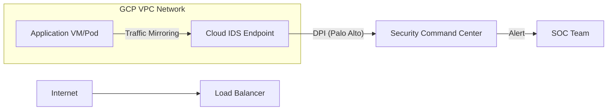

# Cloud IDS: Managed Intrusion Detection & DPI

In a modern cloud environment, traditional firewalls (L3/L4) are not enough. **Cloud IDS (Intrusion Detection System)** provides Deep Packet Inspection (DPI) to identify malware, command-and-control (C2) traffic, and lateral movement.

## 📊 Architecture (Mermaid Diagram)



## 🛡️ Why Cloud IDS? (Senior Architect Perspective)

### 1. Advanced Threat Detection
Cloud IDS uses industry-leading signatures from **Palo Alto Networks**. It identifies threats that hide inside legitimate traffic (e.g., a SQL Injection payload inside an HTTPS request after SSL termination).

### 2. Full Network Visibility
By using **Packet Mirroring**, we gain 100% visibility into VPC traffic without impacting performance. This is critical for auditing and compliance (PCI-DSS, HIPAA).

### 3. Detection of Lateral Movement
While firewalls often focus on the "North-South" (ingress/egress) traffic, Cloud IDS excels at monitoring "East-West" traffic. If an attacker breaches one container, Cloud IDS will detect their attempts to scan or exploit other services in the same VPC.

## 🚀 Key Features in this Demo
1.  **Service Networking Connection**: Setting up the private link between your VPC and the managed IDS project.
2.  **IDS Endpoint**: A managed threat-detection engine (Palo Alto powered).
3.  **Packet Mirroring**: Automated duplication of traffic for real-time inspection.

## 🛠️ Verification (Simulating a Threat)
To verify that Cloud IDS is working, you can simulate a threat from a mirrored VM (e.g., using a specific User-Agent known to be malicious or a test malware pattern):
```bash
# Example: Sending a request with a known malicious pattern (for testing)
curl -H "User-Agent: PaloAltoNetworks-Test-Threat" http://example.com
```
Findings will appear in **Security Command Center (SCC)** or **Cloud Logging**.

---
*Reference: [GCP Cloud IDS Documentation](https://cloud.google.com/cloud-ids/docs)*
