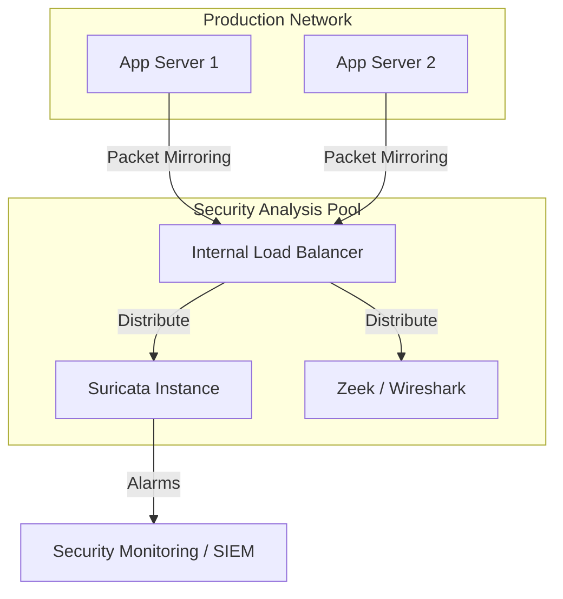

# Packet Mirroring: Full Traffic Analysis & NDR (Network Detection and Response)

In traditional security, we rely on logs to understand what happened. **Packet Mirroring** takes this to the next level by capturing a full copy of all VPC traffic (TCP, UDP, ICMP) and sending it to a pool of security collectors for real-time inspection.

## 📊 Architecture (Mermaid Diagram)



## 🛡️ Senior Architect Perspective

### 1. Network Detection and Response (NDR)
Packet Mirroring is the foundation for an **NDR** strategy. Unlike Cloud IDS, which is a managed service, Packet Mirroring allows you to deploy and customize your own inspection tools (e.g., **Suricata**, **Zeek**, **Snort**). This is critical for organizations with complex compliance needs or those looking for deep, custom protocol analysis.

### 2. Forensic Analysis & Troubleshooting
When a breach occurs, having a copy of the actual packets is the "gold standard" of evidence. It allows security teams to reconstruct exactly what the attacker did, what data was accessed, and how it was exfiltrated.

### 3. Non-Intrusive Inspection
One of the biggest advantages of Packet Mirroring is that it is **passive**. It does not impact the performance or latency of the production application, as the traffic is mirrored at the VPC infrastructure level, not within the OS or application.

## 🚀 Key Features in this Demo
1.  **VPC Traffic Mirroring**: Capturing ingress and egress traffic for a specific production subnet.
2.  **Internal Load Balancer (ILB)**: Distributing mirrored traffic across a scalable pool of security collectors.
3.  **Traffic Filtering**: Selecting specific protocols (TCP, UDP, ICMP) for analysis to optimize collector performance.

## 🛠️ How to Verify?
To verify that traffic is being mirrored, you can run a packet capture tool (like `tcpdump` or `wireshark`) on one of the collector instances:
```bash
# On the collector instance:
sudo tcpdump -i eth0 -n "not port 80" # Avoid health check noise
```
Then, generate some traffic on a VM in the production subnet (e.g., `curl http://example.com`), and you should see a duplicate of that traffic on the collector instance.

---
*Reference: [GCP Packet Mirroring Documentation](https://cloud.google.com/vpc/docs/packet-mirroring)*
