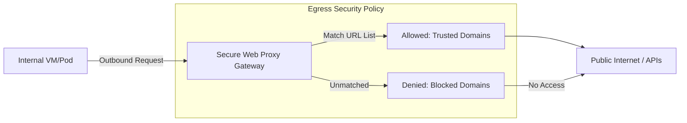

# Secure Web Proxy: Managed Egress Security & FQDN Filtering

In traditional network security, outbound (egress) traffic is managed via NAT or Firewall rules based on IP/Port. However, modern cloud workloads connect to a vast array of APIs and services, making IP-based filtering brittle. **Secure Web Proxy (SWP)** provides a managed, cloud-native way to secure egress traffic using Domain Names (FQDNs).

## 📊 Architecture (Mermaid Diagram)



## 🛡️ Why Secure Web Proxy? (Senior Architect Perspective)

### 1. Beyond IP Filtering (FQDN-based Security)
Traditional firewalls require you to maintain long lists of IP addresses for services like Google APIs or GitHub. These IPs change frequently. SWP allows you to define policies based on domain names (e.g., `*.googleapis.com`), which is significantly more robust and secure.

### 2. TLS Inspection (Deep Packet Inspection)
SWP can decrypt TLS traffic to inspect the actual request inside the encrypted tunnel. This allows you to prevent attackers from using legitimate-looking HTTPS connections for command-and-control (C2) or data exfiltration.

### 3. Scalable & Managed
Unlike building your own Squid or Nginx proxy cluster, SWP is a managed Google service. It scales automatically and requires no infrastructure maintenance, reducing the operational burden on the security team.

## 🚀 Key Features in this Demo
1.  **URL Allowlists**: Centralized management of trusted domains.
2.  **Gateway Security Policy**: Defining rules for traffic matching and actions (Allow/Deny).
3.  **Managed Gateway**: The proxy instance that handles the traffic within the VPC.

## 🛠️ Verification
After configuring the proxy, you can test it from an internal VM by setting the proxy environment variable:
```bash
# Point to the internal IP of the SWP Gateway
export https_proxy=http://10.128.0.99:443

# Success: Matches the allowlist
curl -I https://www.googleapis.com

# Failure (403 Forbidden): Does not match the allowlist
curl -I https://www.malicious-site.com
```

---
*Reference: [GCP Secure Web Proxy Documentation](https://cloud.google.com/secure-web-proxy/docs/overview)*
