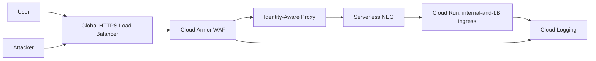

# Secure Cloud Run Edge

This reference architecture protects a Cloud Run service with a global HTTPS Load Balancer, Cloud Armor WAF, Identity-Aware Proxy, and Cloud Run ingress restricted to load-balancer traffic.

## Threat Model

The target workload is an internet-facing application that must resist common edge and identity failures:

- direct access to the default `*.run.app` URL bypassing the edge,
- unauthenticated access to the application,
- SQLi and XSS probes reaching the service,
- brute-force or scraping traffic without rate limits,
- weak evidence after an edge security event.

## Architecture



## Controls

- Cloud Run ingress is `INGRESS_TRAFFIC_INTERNAL_LOAD_BALANCER`.
- Cloud Armor blocks SQLi and XSS preconfigured expressions.
- Cloud Armor rate-limits aggressive clients.
- Backend service has IAP enabled.
- IAP access is granted only to configured identities.
- Backend logging is enabled for edge evidence.
- Runtime service account starts with no project roles unless explicitly provided.

## Terraform

```bash
cd cloud-security/gcp/reference-architectures/secure-cloud-run-edge/terraform
cp terraform.tfvars.example terraform.tfvars
terraform init
terraform plan
```

Minimal composition example:

```bash
cd cloud-security/gcp/reference-architectures/secure-cloud-run-edge/examples/minimal
cp terraform.tfvars.example terraform.tfvars
terraform init
terraform plan
```

## Required Inputs

- `project_id`
- `region`
- `domain_names`
- `container_image`
- `iap_oauth2_client_id`
- `iap_oauth2_client_secret`
- `iap_members`

Use a dedicated test project. The module can enable required APIs when `enable_required_services = true`.

## Validation

After deployment, use [tests/verify_edge_controls.py](./tests/verify_edge_controls.py) to validate expected behavior from outside GCP:

```bash
python3 tests/verify_edge_controls.py \
  --load-balancer-url https://app.example.com \
  --cloud-run-url https://service-hash-region.a.run.app
```

Expected results:

- direct Cloud Run URL is denied or unavailable,
- unauthenticated load balancer access is denied or redirected by IAP,
- SQLi/XSS probes are blocked by Cloud Armor,
- health endpoint is not directly exposed unless authenticated through IAP.

## Evidence

Capture redacted proof in [evidence/README.md](./evidence/README.md):

- Terraform plan summary,
- load balancer IP and backend service name,
- Cloud Armor denied request logs,
- IAP denied unauthenticated request,
- direct Cloud Run access blocked by ingress.

## Cleanup

Run `terraform destroy` from the directory used for deployment. Managed certificates and global forwarding rules may take several minutes to delete.

