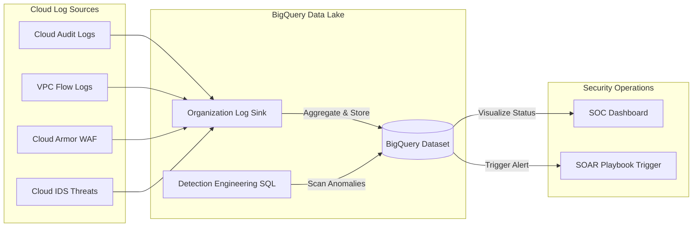

# Security Data Lake & Detection Engineering (GCP SIEM)

Modern security operations are shifting from traditional, expensive SIEMs (Security Information and Event Management) to **Security Data Lakes**. This module demonstrates how to use **BigQuery** as a highly-scalable security analytics platform for advanced threat detection.

## 📊 Detection Pipeline (Mermaid Diagram)



## 🛡️ Senior Architect Strategy: The "SIEM-less" Approach

### 1. Unified Logging (No Silos)
A senior security architect ensures that all security-critical logs (Audit, Network, WAF, IDS) are aggregated into a single location. This allows for **Cross-Log Correlation** – e.g., matching a Cloud Armor block (WAF) with a VPC Flow Log (Network) and a Service Account login (Identity).

### 2. Detection Engineering (SQL as Detection Language)
Instead of relying on proprietary, closed detection engines, we use **Standard SQL**. This allows us to write complex, long-running queries to find:
- **Low-and-Slow Beaconing**: Detecting a C2 connection that communicates at regular intervals.
- **Insider Threats**: Finding unusual data exfiltration patterns from GCS (large volume, unusual hours).
- **Identity Hijacking**: Detecting a user logging in from two different countries within an impossible timeframe.

### 3. Scalability & Cost
Traditional SIEMs often charge by the volume of data ingested. BigQuery allows you to store petabytes of security data and pay only for the storage and the queries you run, making it the most cost-effective solution for long-term forensic logs.

## 🚀 Key Components
1.  **Organization Log Sink**: Centralized exporter for high-value security logs across all GCP projects.
2.  **BigQuery Dataset**: Secure, partitioned, and clustered storage for petabytes of security data.
3.  **SQL Detection Rules**: Production-ready queries for finding Brute Force, Beaconing, and Data Exfiltration.

## Terraform baseline

The module now provides a productized Terraform baseline:

```text
terraform/
  versions.tf
  variables.tf
  main.tf
  outputs.tf
  terraform.tfvars.example
examples/
  minimal/
```

Supported deployment shapes:

- project-level log sink for sandbox review,
- folder-level log sink for controlled platform teams,
- organization-level log sink for centralized SecOps,
- BigQuery dataset IAM binding for the generated sink writer identity,
- optional BigQuery scheduled detections based on the detection-as-code SQL files.

Minimal review path:

```bash
python3 secops/security-data-lake/tests/verify_terraform_contract.py
cd secops/security-data-lake/examples/minimal
terraform init
terraform plan -var="project_id=demo-security-sandbox"
```

Do not enable scheduled detections until exported log tables exist and query cost has been reviewed.

## Detection-as-Code Layout

Detections are now structured under [detections/](./detections/):

```text
detections/
  manifest.yaml
  detection-name/
    README.md
    metadata.yaml
    query.sql
    sample-events.json
    expected-result.json
```

The current baseline includes:

- [Brute Force Login Attempts](./detections/brute-force-login/README.md)
- [Low-and-Slow Network Beaconing](./detections/low-and-slow-beaconing/README.md)
- [Large GCS Data Exfiltration](./detections/gcs-data-exfiltration/README.md)

## 🛠️ How to Implement?
1. Run the local contract check.
2. Review `terraform/terraform.tfvars.example` and choose `sink_scope`.
3. Deploy the BigQuery dataset and Log Sink with Terraform in an isolated project or folder.
4. Wait for logs to populate, for example Cloud Audit, VPC Flow, WAF, and IDS logs.
5. Run the SQL queries in BigQuery or enable scheduled detections after query cost review.
6. Connect high-confidence alerts to the [SOAR module](../soar-architecture/README.md).

---
*Reference: [GCP Security Log Analysis with BigQuery](https://cloud.google.com/architecture/security-log-analytics)*
